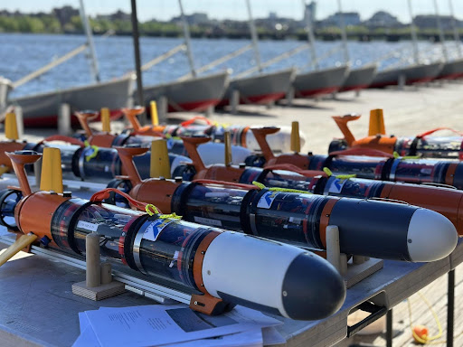
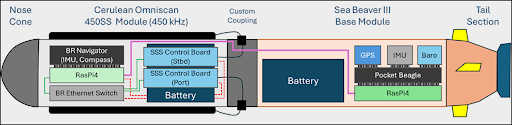
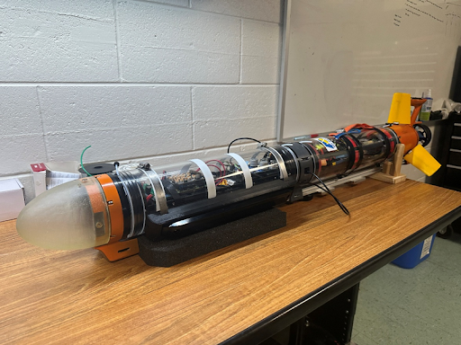
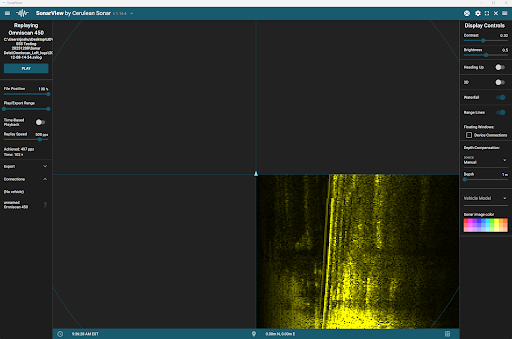

# AUV Payload Module Integration: Cerulean Side-Scan Sonar on SeaBeaver III

## Motivation
Autonomous Underwater Vehicles (AUVs) are powerful tools for seafloor mapping and habitat assessment, but high-resolution sonar payloads are often expensive and difficult to integrate.  
This project demonstrates a **low-cost, modular integration** of a Cerulean 450 kHz side-scan sonar (SSS) with MIT’s **SeaBeaver III micro-AUV**, enabling wide-swath imaging and laying the groundwork for future machine learning–based navigation.

*Figure 1: SeaBeaver III in its unaltered state.*
---

## Objectives
- Mechanically mount and cable the Cerulean OmniScan 450 transducers using custom 3D-printed parts and WetLink penetrators.  
- Integrate electrical power distribution with fault-tolerant protection (fuses, low-voltage disconnect, magnetic switch).  
- Implement software control and logging on a Raspberry Pi 4 + Blue Robotics Navigator, interoperable with MOOS-IvP middleware.  
- Validate the system through **bench tests** and **pool trials**, ensuring stable power, networking, and sonar signal acquisition.  

---

## System Overview
- **Platform:** MIT SeaBeaver III micro-AUV  
- **Payload:** Dual Cerulean OmniScan 450 kHz transducers in a 4" acrylic housing with custom flange + nose cone  
- **Compute & I/O:** Raspberry Pi 4 (8 GB) + Blue Robotics Navigator, gigabit Ethernet switch  
- **Power:** 14.8 V Li-ion/LiPo batteries with star-distribution and branch fusing  
- **Software:** MOOS-IvP middleware, PyMOOS bridge, Python scripts for sensor control and logging  

*Figure 2: Side Scan Sonar Module hardware layout.*

---

## How It Works
1. **Mechanical Integration**  
   - 3D-printed saddles and nose cone mount the sonar module to the SeaBeaver III.  
   - WetLink penetrators provide watertight cabling between wet and dry sides.  

2. **Electrical Integration**  
   - Power tree with main fuse, low-voltage disconnect, and branch fuses.  
   - Star topology wiring minimizes EMI and ensures fault isolation.  

3. **Software Integration**  
   - Raspberry Pi runs MOOS-IvP middleware for mission communication.  
   - PyMOOS bridge enables Python scripts to toggle transducers based on GPS/depth data.  
   - Logged sonar data stored onboard in `.svlog` format for later analysis.  

4. **Testing**  
   - Bench tests verified power stability and sensor activation logic.  
   - Pool trials demonstrated successful sonar activation, neutral buoyancy, and mission execution.  

*Figure 3: Completed AUV with integrated side‑scan sonar module.*

---

## Results
- Successful integration of Cerulean OmniScan 450 with SeaBeaver III.  
- Verified sensor activation logic tied to mission parameters.  
- Collected side-scan sonar data during pool trials, establishing proof-of-concept.  

*Figure 4: Sonar Scan of pool floor.*

---

## Next Steps
- Improve vacuum seal reliability with epoxy-potted WetLink connectors.  
- Refine transducer control logic to toggle based on mission flags, GPS waypoints, and depth.  
- Extend software pipeline to support **real-time machine learning** for sonar image segmentation and terrain-aided navigation (TAN).  
- Conduct **at-sea evaluations** for mosaicking and navigation experiments.  

---

## Contributions
- **Joshua Lewis:** Mechanical design, 3D printing, hardware assembly, ballast/trim testing.  
- **Jacob Munoz:** Software integration with MOOS-IvP, Python sensor control, communication scripts.  
- **Riya Baranwal:** Electrical architecture design, power distribution, EMI mitigation, bench validation.  

---

## References
- Cerulean Sonar (2025). *Omniscan 450 SS & 450 SS BlueBoat*.  
- MIT SeaBeaver Project (2025). *SeaBeaver III micro-AUV documentation*.  

---

## Acknowledgments
This project was completed as part of **MEEG666 Independent Study (MSR), Fall 2025** under the guidance of **Dr. Art Trembanis**.  
It represents Step 1 of a larger doctoral research effort in sonar integration, machine learning, and terrain-aided navigation.

